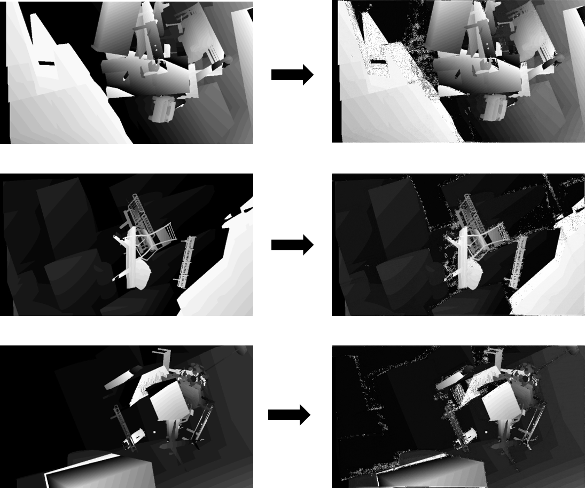

# (APWeb-WAIM 2023)STTR-3D: Stereo Transformer 3D Network for Video Depth Estimation

We introduce STTR3D, a 3D extension of the **ST**ereo **TR**ansformer (STTR) which leverages transformers and attention mechanism to handle stereo depth estimation. We further make use of the SceneFlow FlyingThings3D dataset which openly includes data for disparity change and apply 1) refinements through the use of MLP over relative position encoding and 2) regression head with an entropy-regularized optimal transport to obtain a disparity change map. This model consistently demonstrates  superior performance for depth estimation as  compared to  the original model. In comparison to the existing supervised learning methods for stereo and depth estimation, our technique handles  both depth estimation and depth change problem with an end-to-end network, also establishing that the addition of our transformer yields improved performance that achieves high precision for both problems.

## Result

> result on FlyingThings3D subset



## RoadMap

| Date   | Event                                      |
| ------ | ------------------------------------------ |
| 202207 | Finish the paper                           |
| 202206 | Write the paper                            |
| 202205 | Get the result on FlyingThings and Driving |
| 202204 | Start debug traning                        |
| 202203 | Optimize the model                         |
| 202202 | Complete the design                        |
| 202201 | Test dataset loader                        |
| 202112 | Design the model                           |
| 202110 | Start this idea                            |

## STTR-3D

Schematics of STTR3D. The network extracts features of left and right frames in $t_1, t_2$ by using a shared Encoder and Decoder. The extracted features are processed by STTR3D-TR and STTR-TR subnets, where `TR` denote Transformer and Regression. For STTR3D-TR, two left image feature maps are processed by Tansformer3D after adding positional encoding from the MLP encoder. The two maps are sent for optimal transport to generate the matching score map. Regression3D takes the disparity map from two depth frames and matching score maps to gain the raw disparity change map. The raw disparity change map is then sent to Context Adjustment Layer 3D with two left frames to get the final disparity change map. For STTR-TR, it takes 4 feature maps. It also uses a Transformer to update the feature and uses optimal transport with regression to gain a raw disparity map. The context adjustment layer 3D leverages all the origin stereo images to adjust the disparity maps.


## Installation

### Requirements

STTR-3D's dependences are listed in `requirements.txt`, you can prepare the environment by yourself, but we recommend the following steps:

- Create your Python virtual environment by

  ```
  conda create --name sttr3d python=3.9 
  ```

- Install PyTorch: [here](https://pytorch.org/get-started/locally/), PyTorch version must be at least 1.9

- Install package:

  ```
  pip install -r requirements.txt
  ```

### Pre-trained Models

we recommend you to use pre-trained model, since Transformer based model is hard to train

- Baidu download link:

  link:https://pan.baidu.com/s/1aZtCg_m8X9y9TtXjh2pGzA

  password:`5vjf`

## Dataset

We use the FlyingThings3D subsets to trained our model and tested on the validation split. We also tested it on the Scene Flow Driving Dataset, both datasets can be download through this link: [Computer Vision Group, Freiburg (uni-freiburg.de)](https://lmb.informatik.uni-freiburg.de/resources/datasets/SceneFlowDatasets.en.html)


Train or validation dataset directory should be organized as follow:

```
<your dataset name>
	|__RGBcleanpass
		|__left
			|__<data files>
		|__right
	|__disparity
		|__left
		|__right
	|__occlusion
		|__left
		|__right
	|__disp_change
		|__left
		|__right
```

Or you can check the file `./dataset/scene_flow.py` to customize you structure

## Train or validation

Before training, you need to modify the parameters of the model, please check `./utilites/integration_tools.py` to change you own dataset path. Then you can start training by the command:

```
cd <project directory>
conda activate sttr3d
python3 train_dc.py
```

For validation, you can start validation by the command:

```
cd <project directory>
conda activate sttr3d
python3 evaluate.py
```

## FAQ

1. How to change the arguments about the program? I can't find any command including arguments

   All the arguments are written in the file `./utilites/integration_tools.py`, since it's easier for Windows to modify the arguments. After each time you start training, you can check all the parameters in the Tensorboard log directory.

2. What GPU should I use to train/inference this model?

   We recommend at least 24GB GPU memory to train this model. If you don't have such a GPU :

   - you may set a large downsample ratio in the file `./utilites/integration_tools.py` to reduce the GPU memory usage, but this will cause worse results.
   - you can also change the crop size to predict more times on one single image pair.

3. How do the model distinct the frame of different sequence? Since all the frames are in one folder.

   The number of disparity change map can help us find the discontinuity. For example, if frame 19 and frame 20 are not in the same sequence, the disparity change file of number 20 will be not found in the folder. By using try-except can we organize the data.

4. Why do we need both left and right data for disparity, occlusion, and disparity change?

   Because the data of FlyingThings3D subset can not be used for training STTR-TR. We need to use left and right data to get the correct data to train the model.

## Acknowledge

This work is based on [STTR](https://github.com/mli0603/stereo-transformer), it's also inspired by [SuperGlue](https://github.com/HeatherJiaZG/SuperGlue-pytorch).

## License

The methods provided on this page are published under the [Creative Commons Attribution-NonCommercial-ShareAlike 3.0 License](http://creativecommons.org/licenses/by-nc-sa/3.0/) . This means that you must attribute the work in the manner specified by the authors, you may not use this work for commercial purposes and if you alter, transform, or build upon this work, you may distribute the resulting work only under the same license. If you are interested in commercial usage you can contact us for further options.
